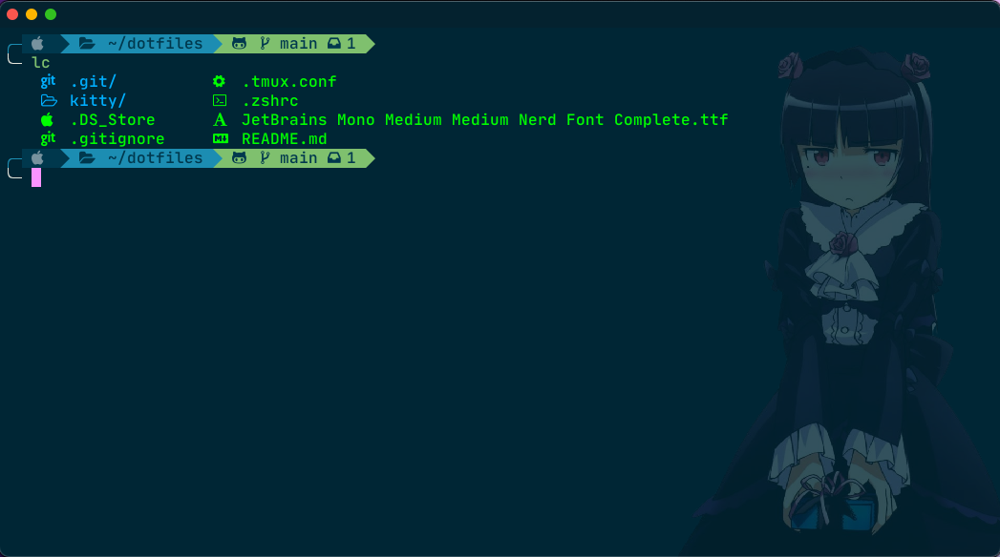

# Dotfiles



## How to customize terminal

1. Install ohmyzsh
```
sh -c "$(wget -O- https://raw.githubusercontent.com/ohmyzsh/ohmyzsh/master/tools/install.sh)"
```
2. Install nerdfont: Double click to JetBrains font in this folder
3. Install powerlevel10k for better terminal prompt:
```
git clone --depth=1 https://github.com/romkatv/powerlevel10k.git $ZSH_CUSTOM/themes/powerlevel10k
```
4. Configure terminal:
```
cp ~/.zshrc ~/.zshrc-old        # backup current config
cp ./.zshrc ~/.zshrc
```
5. Install colorls for better ls with icons using lc:
```
gem install colorls
```

6. Install kitty:
```
brew install kitty
```
7. Copy kitty config:
```
cp ./kitty ~/.config/kitty
```
8. Install missing ohmyzsh plugins configuration
```
git clone https://github.com/zsh-users/zsh-history-substring-search ${ZSH_CUSTOM:-~/.oh-my-zsh/custom}/plugins/zsh-history-substring-search
git clone https://github.com/zsh-users/zsh-autosuggestions ${ZSH_CUSTOM:-~/.oh-my-zsh/custom}/plugins/zsh-autosuggestions
git clone https://github.com/zsh-users/zsh-syntax-highlighting.git ${ZSH_CUSTOM:-~/.oh-my-zsh/custom}/plugins/zsh-syntax-highlighting
cd ~/.oh-my-zsh/custom/plugins/
git clone https://github.com/unixorn/warhol.plugin.zsh.git warhol
git clone https://github.com/zsh-users/zsh-completions ${ZSH_CUSTOM:=~/.oh-my-zsh/custom}/plugins/zsh-completions

```

If some plugin installation is missing, go to github repository of that plugin and there should be the explanation for install It.

